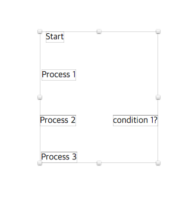
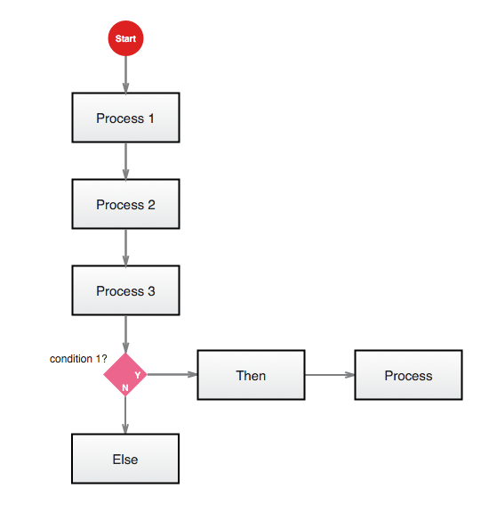

# Flowmate

Don't draw a shpae and type text. Write your story, process or task first, then make shpaes with the text automatically. It's just speedy and super simple. 

## Insatll Plugin 

### Sketch Toolbox

1. Install [Sekcth Toolbox](http://sketchtoolbox.com/)
2. Search `Flowmate`
3. Click `Install`

### Manually

1. [Download the flowmate Zip file](https://github.com/wodory/flowmate/archive/master.zip) and extract it. 
2. Copy the folder to the plugin folder (Open up Sketch, and go to `Plugins` › `Reveal Plugins Folder…` to open it.)
3. The 'flowmate' plugin is appeared in the `Plugins` menu.

## How to Use 

### Step 1
Just add the label first, 

### Step 2
And press magic keys like 
* Ctrl+Shift+P : Process 
* Ctrl+Shift+D : Decision
* Ctrl+Shift+L : Label
* Ctrl+Shift+R : Reference
* Ctrl+Shift+C : Connect

### Option

Modify `lib/options.js` if you wanna use your own options like shape/border colors and so on.

## To do

- [ ] Group and connect to/from group
- [ ] Smart align - to align Decision and other symbol
- [ ] Smart connect - really hard :-(
- [ ] Redraw connect - Redraw connectors if the shapes are moved
- [ ] Option dialog - Change shape/connector/border color and so on... 

## Special Thanks 

#### [tadija - AEFlowcahrt](https://github.com/tadija/AEFlowchart)

The flowmate is inspired by AEFlowchart. The concept is great and I use some codes he made. Thanks tadija!

#### [Dan brown - Communicating Design 2nd edition](http://www.amazon.com/Communicating-Design-Developing-Documentation-Planning/dp/0321712463)

The style of flowchart, espacially the decision symbol, is based on [Communicating Design 2nd edition](http://www.amazon.com/Communicating-Design-Developing-Documentation-Planning/dp/0321712463) by Dan Brown. His book is one of the best UX book in my opinion even he doesn't know me ;-) 

#### [utmo](https://github.com/utom/) and [marcosvidal](https://github.com/marcosvidal)

When I stared to develop my own plugin, there code is great examples. 
